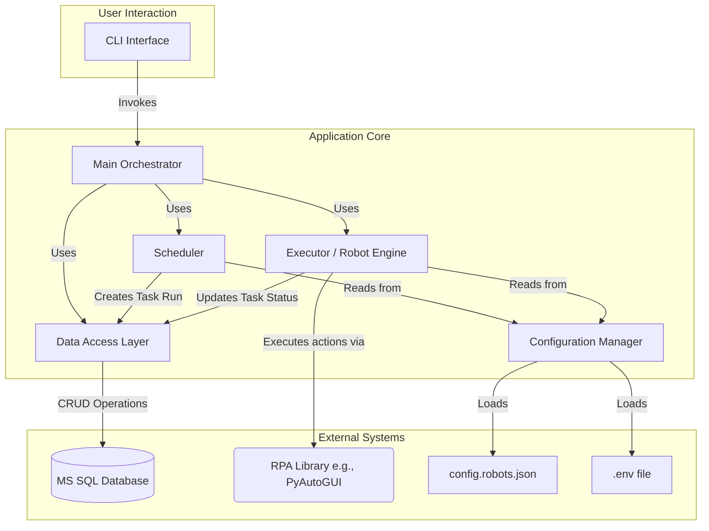

# Design Plan: Python-based RPA Orchestrator

## 1. Executive Summary & Goals
This document outlines the design and phased implementation plan for a new Python-based command-line application, `vibe-python`, intended to orchestrate Robotic Process Automation (RPA) tasks. The system is designed to be configuration-driven, allowing for easy addition and management of robots through a JSON file, with all operational data persisted in a Microsoft SQL Server database.

The key goals of this plan are:
*   **Establish a Modular Architecture:** Create a well-structured application with clear separation of concerns (scheduling, execution, data persistence, configuration).
*   **Deliver a Configuration-Driven System:** Enable users to define, schedule, and modify robot tasks by editing a simple JSON configuration file, without changing application code.
*   **Provide Operational Visibility:** Implement a robust database logging and state management system, accessible via a Command Line Interface (CLI), to monitor robot status and rerun failed tasks.

## 2. Current Situation Analysis
This is a greenfield project, starting from an initial application description. There is no existing codebase. The requirements specify a Python CLI application, dynamic robot definition via JSON, task scheduling, use of a `.env` file for credentials, and MS SQL Server for data storage. The core challenge is to design a cohesive system that integrates these components into a reliable and maintainable RPA orchestrator.

## 3. Proposed Solution / Refactoring Strategy

### 3.1. High-Level Design / Architectural Overview
The proposed architecture is based on a modular design, separating the core responsibilities of the application. An Orchestrator will serve as the main entry point, coordinating the other components.

*   **CLI (`Typer`):** The user interface for manual control and status checks.
*   **Configuration Manager:** Loads and validates `config.robots.json` and `.env` files.
*   **Scheduler (`APScheduler`):** Triggers robot tasks based on schedules defined in the configuration. It will add jobs to a task queue (represented by a DB table).
*   **Executor/Robot Engine:** The core component that processes a task from the queue. It reads the robot's action sequence from the configuration and uses an RPA library (e.g., `pyautogui`) to perform the actions.
*   **Data Access Layer (DAL) (`SQLAlchemy`):** An abstraction layer that handles all communication with the MS SQL Server database, managing task states, and logging.

Here is a diagram representing the component interactions:



### 3.2. Key Components / Modules
*   **`main.py` (Orchestrator & CLI):**
    *   **Responsibilities:** Application entry point. Initializes all other components. Defines the CLI commands using `Typer` (e.g., `start-scheduler`, `run-now`, `check-status`).
*   **`config.py` (Configuration Manager):**
    *   **Responsibilities:** Uses `pydantic` to define models for the robot configuration, ensuring validation. Loads `.env` for database credentials and other secrets. Loads and parses `config.robots.json`.
*   **`database.py` (Data Access Layer):**
    *   **Responsibilities:** Uses `SQLAlchemy` to define database models (Robots, TaskRuns, Logs). Manages the database session and provides functions for creating, updating, and querying records (e.g., `create_task_run`, `update_task_status`, `get_last_run_status`).
*   **`scheduler.py` (Scheduler):**
    *   **Responsibilities:** Initializes `APScheduler` with a `SQLAlchemyJobStore` for persistence. Reads robot schedules from the configuration and schedules jobs. Each scheduled job's role is to create a "Pending" task entry in the database for the Executor to pick up.
*   **`executor.py` (Executor / Robot Engine):**
    *   **Responsibilities:** This is the worker. It queries the database for "Pending" tasks. When a task is found, it updates its status to "Running", fetches the corresponding robot's action sequence from the configuration, and executes each action in a loop. It handles exceptions, logs results, and updates the final task status ("Success" or "Failed") in the database.

### 3.3. Detailed Action Plan / Phases

#### Phase 1: Core Engine & Manual Execution
*   **Objective(s):** Build the foundational components and enable manual triggering of a robot from the CLI.
*   **Priority:** High

*   **Task 1.1: Project Scaffolding and Dependency Setup**
    *   **Rationale/Goal:** Establish a clean project structure and install necessary libraries.
    *   **Estimated Effort:** S
    *   **Deliverable/Criteria for Completion:** A `pyproject.toml` (or `requirements.txt`) is created. Libraries like `typer`, `pydantic`, `python-dotenv`, `pyautogui`, `SQLAlchemy`, and `pyodbc` (or other DB driver) are added. Basic directory structure (`src/vibe_python/`, `configs/`, `tests/`) is in place.

*   **Task 1.2: Define Configuration Models**
    *   **Rationale/Goal:** Create a strongly-typed and validated structure for robot definitions.
    *   **Estimated Effort:** S
    *   **Deliverable/Criteria for Completion:** `pydantic` models are defined for `Robot`, `Action`, and `Schedule`. A sample `config.robots.json` is created. The `config.py` module can successfully load and parse this file.

*   **Task 1.3: Implement the Core Robot Executor**
    *   **Rationale/Goal:** Create the engine that translates a robot's action list into desktop actions.
    *   **Estimated Effort:** M
    *   **Deliverable/Criteria for Completion:** The `executor.py` module has a function that accepts a robot configuration object and executes its actions using `pyautogui`. Basic logging to the console is implemented.

*   **Task 1.4: Build a Basic CLI for Manual Triggering**
    *   **Rationale/Goal:** Provide the first user-facing interaction to test the core executor.
    *   **Estimated Effort:** S
    *   **Deliverable/Criteria for Completion:** A CLI command `vibe-python run-now <robot_name>` is implemented using `Typer`. This command loads the config, finds the specified robot, and passes it to the executor.

---

#### Phase 2: Database Integration and State Management
*   **Objective(s):** Persist all operational data, track task execution state, and provide status visibility via the CLI.
*   **Priority:** High

*   **Task 2.1: Design and Implement Database Schema**
    *   **Rationale/Goal:** Define the data structures for storing state and logs.
    *   **Estimated Effort:** M
    *   **Deliverable/Criteria for Completion:** `SQLAlchemy` models for `TaskRun` and `LogEntry` tables are created in `database.py`. A script to initialize the database schema is written.

*   **Task 2.2: Implement the Data Access Layer (DAL)**
    *   **Rationale/Goal:** Abstract all database interactions into a single, testable module.
    *   **Estimated Effort:** M
    *   **Deliverable/Criteria for Completion:** The `database.py` module contains functions like `create_task_run`, `update_task_status`, `get_task_by_id`, `add_log_entry`. It correctly connects to the MS SQL Server using credentials from `.env`.

*   **Task 2.3: Integrate DAL with the Executor**
    *   **Rationale/Goal:** Replace console logging with structured database logging and state transitions.
    *   **Estimated Effort:** M
    *   **Deliverable/Criteria for Completion:** The `Executor` now creates a `TaskRun` record before starting, updates its status during execution, and records the final outcome (Success/Failed) with details upon completion. All logs are written to the `LogEntry` table.

*   **Task 2.4: Implement CLI Status Commands**
    *   **Rationale/Goal:** Allow users to query the state of the system from the CLI.
    *   **Estimated Effort:** S
    *   **Deliverable/Criteria for Completion:** New CLI commands are available: `vibe-python status` (shows the last N runs) and `vibe-python rerun <task_run_id>` (creates a new "Pending" task based on a previous failed one).

---

#### Phase 3: Scheduling and Automation
*   **Objective(s):** Implement the automatic scheduling of robot tasks.
*   **Priority:** Medium

*   **Task 3.1: Integrate `APScheduler`**
    *   **Rationale/Goal:** Add a robust scheduling library to the application.
    *   **Estimated Effort:** M
    *   **Deliverable/Criteria for Completion:** `APScheduler` is added as a dependency. The `scheduler.py` module is created and can initialize the scheduler, preferably with a `SQLAlchemyJobStore` to persist schedules.

*   **Task 3.2: Implement Schedule Loading**
    *   **Rationale/Goal:** Dynamically create scheduled jobs based on the `config.robots.json` file.
    *   **Estimated Effort:** M
    *   **Deliverable/Criteria for Completion:** The `Scheduler` reads all robot configurations on startup, parses their `schedule` info (e.g., using `cron` format), and adds a job to `APScheduler` for each. The job's task will be to simply call the DAL's `create_task_run` function.

*   **Task 3.3: Create the Main Orchestration Loop**
    *   **Rationale/Goal:** Tie the scheduler and executor together into a long-running service.
    *   **Estimated Effort:** M
    *   **Deliverable/Criteria for Completion:** A new CLI command `vibe-python start-service` is created. This command starts the scheduler and then enters a loop where it periodically calls the `Executor` to process any "Pending" tasks from the database. This decouples scheduling from execution.

### 3.4. Data Model Changes
#### `config.robots.json` Structure
```json
[
  {
    "robot_name": "daily_report_generator",
    "description": "Logs into system and downloads the daily sales report.",
    "enabled": true,
    "schedule": {
      "type": "cron",
      "expression": "0 8 * * 1-5" // 8 AM, Mon-Fri
    },
    "actions": [
      {
        "type": "move_to", "params": {"x": 100, "y": 200}, "description": "Move to username field"
      },
      {
        "type": "click", "params": {}, "description": "Click username field"
      },
      {
        "type": "write", "params": {"text": "my_username"}, "description": "Enter username"
      },
      {
        "type": "press", "params": {"key": "tab"}, "description": "Move to password field"
      },
      {
        "type": "wait", "params": {"seconds": 0.5}, "description": "Short pause"
      },
      {
        "type": "screenshot", "params": {"filename": "login_screen.png"}, "description": "Capture login screen"
      }
    ]
  }
]
```

#### Database Schema (Conceptual)
*   **`TaskRuns` Table:**
    *   `id` (PK, int, auto-increment)
    *   `robot_name` (varchar)
    *   `status` (varchar: 'Pending', 'Running', 'Success', 'Failed')
    *   `created_at` (datetime)
    *   `started_at` (datetime, nullable)
    *   `completed_at` (datetime, nullable)
    *   `result_message` (varchar, nullable)

*   **`LogEntries` Table:**
    *   `id` (PK, int, auto-increment)
    *   `task_run_id` (FK to TaskRuns.id)
    *   `timestamp` (datetime)
    *   `level` (varchar: 'INFO', 'WARN', 'ERROR')
    *   `message` (varchar)
    *   `screenshot_path` (varchar, nullable)

### 3.5. API Design / Interface Changes
The primary interface is the Command Line. The proposed commands are:
*   `vibe-python start-service`: Starts the scheduler and the executor worker in a long-running process.
*   `vibe-python run-now <robot_name>`: Immediately queues a robot for a single run.
*   `vibe-python status [--limit <N>]`: Shows the status of the last `N` task runs.
*   `vibe-python status <task_run_id>`: Shows detailed status and logs for a specific task run.
*   `vibe-python rerun <task_run_id>`: Re-queues a past task run for execution.
*   `vibe-python list-robots`: Lists all robots defined in the configuration file.

## 4. Key Considerations & Risk Mitigation
### 4.1. Technical Risks & Challenges
*   **Brittle RPA Actions:** UI changes can easily break robots.
    *   **Mitigation:** The `Executor` must have robust `try...except` blocks around each action. On failure, it should take a screenshot, log the error details to the database, and mark the `TaskRun` as 'Failed'.
*   **Environment Differences:** Screen resolution and application window positions can vary.
    *   **Mitigation:** The plan should encourage defining actions relative to found images rather than absolute coordinates where possible (a potential feature for `pyautogui`). Document the expected screen resolution for robot execution.
*   **Secrets Management:** Storing production credentials in `.env` is not secure.
    *   **Mitigation:** The `.env` approach is suitable for initial development. The plan acknowledges that a production deployment should use a secure secret store (e.g., HashiCorp Vault, Azure Key Vault, AWS Secrets Manager). The `config.py` module can be adapted to pull from these sources.
*   **Scheduler Resilience:** A simple script process can be terminated or crash.
    *   **Mitigation:** Using `APScheduler` with a `SQLAlchemyJobStore` ensures that schedules are not lost on restart. For production, the application should be run as a system service (e.g., systemd on Linux, Windows Service) to ensure it's always running.

### 4.2. Dependencies
*   **Internal:** Phases are sequential. The DB integration (Phase 2) is required before scheduling (Phase 3) can be fully effective. The core executor (Phase 1) is a prerequisite for all other phases.
*   **External:** The system depends on a running and accessible MS SQL Server instance. The machine running the orchestrator must have a graphical desktop environment and all applications the robots interact with must be installed and accessible.

### 4.3. Non-Functional Requirements (NFRs) Addressed
*   **Maintainability:** The modular architecture with a separate DAL, Executor, and Scheduler makes the code easier to understand, test, and modify.
*   **Usability:** A clear CLI provides good control and visibility. The JSON configuration makes managing robots accessible to non-developers.
*   **Reliability:** The database-backed queue for tasks ensures that scheduled jobs are not lost if the application restarts. Detailed logging and status tracking help in diagnosing and recovering from failures.
*   **Security:** Using `.env` separates credentials from code. While not production-grade, it's a step towards secure configuration. The plan notes the need for a real secret manager in production.

## 5. Success Metrics / Validation Criteria
The success of this project will be measured by the following criteria:
*   **Functionality:** A user can define a new robot with a schedule in `config.robots.json`, and the system automatically executes it at the specified time without any code changes.
*   **Observability:** A user can query the status of any task run (past or present) via the CLI and see a clear outcome (Success/Failed) and associated logs.
*   **Recoverability:** A user can manually trigger a rerun of a failed task via the CLI.
*   **Performance:** The orchestrator can schedule and execute at least 10 different simple robots without significant performance degradation or delays (initial benchmark).

## 6. Assumptions Made
*   The application will run on an OS with a graphical user interface (e.g., Windows, macOS, or Linux with X11) where `pyautogui` can control the mouse and keyboard.
*   The initial design does not require parallel execution of multiple robots simultaneously. The executor will process one task at a time from the queue.
*   The user is responsible for setting up and providing connection credentials for the MS SQL Server database.
*   The schedules are based on standard `cron` expressions.

## 7. Open Questions / Areas for Further Investigation
*   **RPA Library Choice:** `pyautogui` is proposed for its simplicity with desktop GUI automation. Should the architecture allow for other backends in the future (e.g., `Selenium` for web, `Playwright`)? The `Executor` could be designed with a Strategy Pattern to accommodate this.
*   **Concurrency Model:** Is single-threaded execution sufficient for the long term? A future phase could introduce a worker pool model for parallel execution if throughput becomes a concern.
*   **Configuration Hot-Reloading:** Does the scheduler need to detect changes to `config.robots.json` without a restart? This could be a future enhancement.
*   **Error Handling Strategy:** What is the desired behavior for a sequence of actions if one fails? Should it stop immediately (current plan) or attempt subsequent actions? This could be a configurable property of a robot.

## 8. Assumptions clarifications from owner
* it's correct. A few facts. It will be RDP session. So it will be nice to have option to prevent session to go to screen saver. In feature this app will be run in virtual machine where GUI is always renders
* right, one task at a time
* db connection credentials should be stored in .env
* good enough

## 9. Open Question answers from owner
* right now this solution has to deal only with windows desktop automation. so `pyautogui` should be enough.
* beacuse rpa will work with OS GUI application should be single thread.
* no, user should restart via built-in command the app after editing config.json
* in case of error, app should notificate via email (desktop outlook or web api of outlook in office 365) and proceed execute another tasks.

## 10. Changes required from owner
* there is no need to enhance Secret management method - .env is enough right now