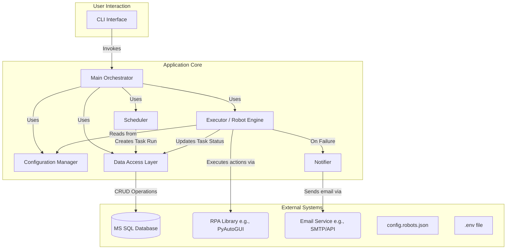

# Enhanced Design Plan: Python-based RPA Orchestrator

## 1. Executive Summary & Goals
This document outlines the enhanced design and phased implementation plan for a new Python-based command-line application, `vibe-python`, intended to orchestrate Robotic Process Automation (RPA) tasks. The system is designed to be configuration-driven, allowing for easy management of robots through a JSON file, with all operational data persisted in a Microsoft SQL Server database. This revision incorporates owner feedback to refine error handling, session management, and operational procedures.

The key goals of this plan are:
*   **Establish a Modular & Resilient Architecture:** Create a well-structured application with clear separation of concerns (scheduling, execution, data persistence, notification) that can gracefully handle task failures.
*   **Deliver a Configuration-Driven System:** Enable users to define, schedule, and modify robot tasks by editing a JSON configuration file, with a clear process for applying changes.
*   **Provide Enhanced Operational Visibility & Control:** Implement robust database logging, CLI-based status monitoring, and automated email notifications for failed tasks.

## 2. Current Situation Analysis
This is a greenfield project based on an initial description and a round of feedback. The core requirements remain: a Python CLI application, dynamic robot definition via JSON, task scheduling, `.env` for configuration, and MS SQL Server for data storage. The plan is now enhanced to include specific requirements for RDP session management and a defined error notification workflow.

## 3. Proposed Solution / Refactoring Strategy

### 3.1. High-Level Design / Architectural Overview
The architecture is modular, with an Orchestrator coordinating components. The key addition is a `Notifier` component responsible for sending email alerts. The system is designed for single-threaded execution within an RDP session, ensuring compatibility with GUI-based automation.

*   **CLI (`Typer`):** User interface for manual control, status checks, and service management.
*   **Configuration Manager:** Loads and validates `config.robots.json` and `.env` files.
*   **Scheduler (`APScheduler`):** Queues tasks by creating "Pending" entries in the database based on configured schedules.
*   **Executor/Robot Engine:** Processes tasks from the queue, executes RPA actions, handles session keep-alive, and manages task state.
*   **Data Access Layer (DAL) (`SQLAlchemy`):** Abstracts all communication with the MS SQL Server database.
*   **Notifier:** A new component responsible for sending email notifications when a task fails.

### 3.2. Key Components / Modules
*   **`main.py` (Orchestrator & CLI):**
    *   **Responsibilities:** Application entry point. Defines CLI commands (`start-service`, `run-now`, `status`, `list-robots`, and a mechanism for `restart-service`).
*   **`config.py` (Configuration Manager):**
    *   **Responsibilities:** Loads and validates `config.robots.json` and `.env` file (for DB and Email credentials).
*   **`database.py` (Data Access Layer):**
    *   **Responsibilities:** Manages DB models (`TaskRun`, `LogEntry`), sessions, and CRUD operations.
*   **`scheduler.py` (Scheduler):**
    *   **Responsibilities:** Reads schedules from config and creates "Pending" tasks in the DB via the DAL.
*   **`executor.py` (Executor / Robot Engine):**
    *   **Responsibilities:** The primary worker.
        1.  Queries the DB for a "Pending" task.
        2.  Executes the robot's action sequence.
        3.  Maintains a "keep-alive" mechanism to prevent session lock.
        4.  On failure: takes a screenshot, logs to DB, calls the `Notifier`, and marks the task "Failed".
        5.  On success: logs to DB and marks the task "Success".
        6.  The orchestrator loop will then pick up the next available task.
*   **`notifier.py` (Notifier):**
    *   **Responsibilities:** Contains logic to send an email. It reads configuration (SMTP server, credentials, recipient list) from the `.env` file via the `ConfigManager`.

### 3.3. Detailed Action Plan / Phases

#### Phase 1: Core Engine & Manual Execution
*   **Objective(s):** Build foundational components, enable manual robot triggering, and ensure session stability.
*   **Priority:** High

*   **Task 1.1: Project Scaffolding and Dependency Setup**
    *   **Rationale/Goal:** Establish a clean project structure and install libraries.
    *   **Estimated Effort:** S
    *   **Deliverable/Criteria for Completion:** `pyproject.toml` created with `typer`, `pydantic`, `python-dotenv`, `pyautogui`, `SQLAlchemy`, `pyodbc`. Directory structure in place.

*   **Task 1.2: Define Configuration Models**
    *   **Rationale/Goal:** Create a strongly-typed structure for robot definitions.
    *   **Estimated Effort:** S
    *   **Deliverable/Criteria for Completion:** `pydantic` models for `Robot`, `Action`, `Schedule` are complete. A sample `config.robots.json` is created and parsed successfully.

*   **Task 1.3: Implement the Core Robot Executor**
    *   **Rationale/Goal:** Create the engine that translates an action list into desktop actions.
    *   **Estimated Effort:** M
    *   **Deliverable/Criteria for Completion:** `executor.py` has a function that accepts a robot config and executes its actions.

*   **Task 1.4: Implement Session Keep-Alive**
    *   **Rationale/Goal:** Prevent RDP session from locking or activating a screensaver during robot execution.
    *   **Estimated Effort:** S
    *   **Deliverable/Criteria for Completion:** The `Executor` includes a background mechanism (e.g., a small, non-disruptive mouse move every few minutes) that runs only when a robot is active. This can be achieved using a separate thread managed by the executor.

*   **Task 1.5: Build a Basic CLI for Manual Triggering**
    *   **Rationale/Goal:** Provide the first user interaction to test the executor.
    *   **Estimated Effort:** S
    *   **Deliverable/Criteria for Completion:** CLI command `vibe-python run-now <robot_name>` is implemented.

---

#### Phase 2: Database Integration, State Management & Notifications
*   **Objective(s):** Persist operational data, track state, and implement failure notifications.
*   **Priority:** High

*   **Task 2.1: Design and Implement Database Schema**
    *   **Rationale/Goal:** Define data structures for storing state and logs.
    *   **Estimated Effort:** M
    *   **Deliverable/Criteria for Completion:** `SQLAlchemy` models for `TaskRun` and `LogEntry` tables are created.

*   **Task 2.2: Implement the Data Access Layer (DAL)**
    *   **Rationale/Goal:** Abstract all database interactions.
    *   **Estimated Effort:** M
    *   **Deliverable/Criteria for Completion:** `database.py` contains all necessary CRUD functions and connects to MS SQL Server.

*   **Task 2.3: Implement Email Notifier**
    *   **Rationale/Goal:** Create the component responsible for sending failure alerts.
    *   **Estimated Effort:** M
    *   **Deliverable/Criteria for Completion:** `notifier.py` can send an email using credentials from `.env`. The email body should be templated to include task name, time of failure, and error message.

*   **Task 2.4: Integrate DAL and Notifier with the Executor**
    *   **Rationale/Goal:** Implement the full execution lifecycle with state persistence and error handling.
    *   **Estimated Effort:** M
    *   **Deliverable/Criteria for Completion:** The `Executor` creates a `TaskRun`, updates its status, and upon failure, calls the `Notifier` before marking the task as "Failed" in the DB.

*   **Task 2.5: Implement CLI Status Commands**
    *   **Rationale/Goal:** Allow users to query system state from the CLI.
    *   **Estimated Effort:** S
    *   **Deliverable/Criteria for Completion:** CLI commands `vibe-python status` and `vibe-python rerun <task_run_id>` are functional.

---

#### Phase 3: Scheduling and Service Operation
*   **Objective(s):** Implement automatic scheduling and reliable service management.
*   **Priority:** Medium

*   **Task 3.1: Integrate `APScheduler`**
    *   **Rationale/Goal:** Add a robust scheduling library.
    *   **Estimated Effort:** M
    *   **Deliverable/Criteria for Completion:** `scheduler.py` module is created and initializes `APScheduler`.

*   **Task 3.2: Implement Schedule Loading**
    *   **Rationale/Goal:** Dynamically create scheduled jobs from the configuration file.
    *   **Estimated Effort:** M
    *   **Deliverable/Criteria for Completion:** On startup, the `Scheduler` reads `config.robots.json` and schedules a job for each enabled robot to create a "Pending" task in the DB.

*   **Task 3.3: Create the Main Orchestration Service**
    *   **Rationale/Goal:** Tie the scheduler and executor into a long-running service.
    *   **Estimated Effort:** M
    *   **Deliverable/Criteria for Completion:** The `vibe-python start-service` command starts the scheduler and a worker loop that processes tasks from the DB queue.

*   **Task 3.4: Implement a Service Restart Mechanism**
    *   **Rationale/Goal:** Allow the user to apply configuration changes by restarting the service gracefully.
    *   **Estimated Effort:** S
    *   **Deliverable/Criteria for Completion:** A wrapper script (e.g., `restart.bat` or `restart.sh`) is created. It finds the running service process ID (e.g., from a `.pid` file) and restarts it. The CLI command `vibe-python restart-service` will simply execute this script. The `start-service` command should be modified to write its process ID to a `.pid` file.

### 3.4. Data Model Changes
*(No changes from previous version)*

### 3.5. API Design / Interface Changes
The primary interface is the Command Line, with an added command for service restarts.
*   `vibe-python start-service`: Starts the service and creates a `.pid` file.
*   `vibe-python restart-service`: Executes a script to stop the old process (using the `.pid` file) and start a new one.
*   `vibe-python run-now <robot_name>`
*   `vibe-python status [--limit <N>]`
*   `vibe-python status <task_run_id>`
*   `vibe-python rerun <task_run_id>`
*   `vibe-python list-robots`

## 4. Key Considerations & Risk Mitigation
### 4.1. Technical Risks & Challenges
*   **Brittle RPA Actions:** UI changes can break robots.
    *   **Mitigation:** The `Executor` will have robust error handling for each action. Failure triggers a screenshot, detailed DB logging, and an email notification.
*   **Environment Differences:** Screen resolution and window positions vary.
    *   **Mitigation:** Encourage use of image-based locating in `pyautogui` where possible. The execution environment (e.g., VM resolution) should be documented and standardized.
*   **Secrets Management:** Credentials are in a plain text `.env` file.
    *   **Mitigation:** This approach has been explicitly approved for the current scope. The file should be secured via filesystem permissions and excluded from version control (`.gitignore`).
*   **Email Delivery Failure:** The external email service could be down or configured incorrectly.
    *   **Mitigation:** The `Notifier` should wrap its sending logic in a `try...except` block and log any errors to the console and/or a local file, so as not to crash the main executor loop.

### 4.2. Dependencies
*   **Internal:** Phases are sequential. Core engine (Phase 1) is required for DB/Notifications (Phase 2), which is required for Scheduling (Phase 3).
*   **External:** A running/accessible MS SQL Server. A functional SMTP server or Office 365 API endpoint for email. A stable RDP session on a Windows machine with a graphical environment.

### 4.3. Non-Functional Requirements (NFRs) Addressed
*   **Maintainability:** Modular design with DI principles makes components testable and swappable.
*   **Usability:** A clear CLI and simple JSON config provide a good user experience. The restart command simplifies the process of applying config changes.
*   **Reliability:** The database-backed queue ensures task persistence. The defined error handling ensures one failed task does not halt the entire system, and operators are notified promptly.
*   **Security:** Using `.env` separates credentials from code, which is a baseline security practice.

## 5. Success Metrics / Validation Criteria
*   **Functionality:** A defined robot runs automatically on schedule. On failure, an email notification is successfully sent, and the orchestrator proceeds to the next task.
*   **Observability:** A user can view the status and logs of any task run via the CLI.
*   **Control:** A user can apply changes to `config.robots.json` and restart the service with a single CLI command.
*   **Stability:** The `start-service` process remains active over long periods, and the RDP session does not lock due to the keep-alive mechanism.

## 6. Assumptions Made
*   The application will run in a dedicated RDP session on a Windows OS.
*   The application will execute one robot at a time (single-threaded execution), as confirmed.
*   The user is responsible for setting up the MS SQL Server and providing valid DB and email credentials in the `.env` file.
*   An SMTP service or Office 365 account is available and accessible from the machine running the application for sending failure notifications.

## 7. Open Questions / Areas for Further Investigation
This section now reflects the decisions made based on owner feedback.
*   **Future-Proofing the Executor:** (Future Consideration) While `pyautogui` is sufficient now, the `Executor` could be designed with a Strategy Pattern. This would allow new execution backends (e.g., for web automation) to be added in the future by creating a new "strategy" class without modifying the core orchestrator logic.
*   **Advanced Error Handling:** (Future Consideration) Should a robot have a configurable number of retry attempts before being marked as "Failed"? This could be added as a property in the `config.robots.json`.
*   **Configuration Management:** (Future Consideration) For a larger number of robots, managing a single large JSON file could become cumbersome. A future version could support a `configs/robots.d/` directory where each robot is defined in its own file.

## 8. Open Questions Answers from product owner
* good enough
* yes add this option to json template for robot information and also plan all needed tasks for this feature
* yes add all needed tasks for this feature